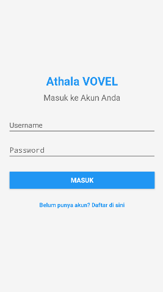
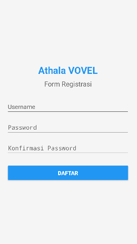

# 🔐 Athala VOVEL - Local Login & Register App (Kotlin)

**Athala VOVEL** is a lightweight Android application built with **Kotlin** and **Jetpack Compose**, showcasing a simple **Login and Register UI** that stores user credentials **locally on the device**.

> No internet connection required — everything is stored on the phone.

---

## ✅ Feature

- 🔐 Local Login & Register system  
  - User data is stored **on the device only**
  - No backend or cloud — ideal for offline use or prototypes

---

## 🖼️ UI Screenshots

### 🔐 Login Screen

### 📝 Register Screen

> Place your screenshots inside the `screenshots/` folder at the root of the project.

---

## ⚙️ Tech Overview

- **Language:** Kotlin  
- **UI:** Jetpack Compose  
- **Data Storage:** Local only (e.g. SharedPreferences)  
- **Min SDK:** 21 (Lollipop)  
- **No Backend:** Offline functionality only

